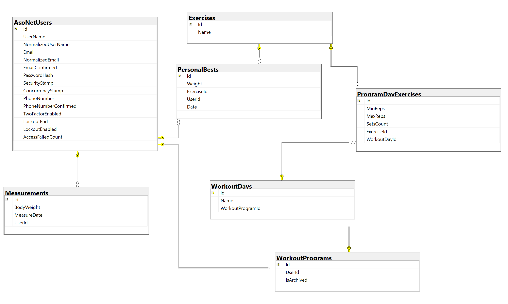

# My Fitness Journey

## Tech Stack
**C#** - Programming Language

**ASP.NET Core** - Web Framework (Model-View-Controller)

**ASP.NET Core Identity** - Authentication and Authorization

**EntityFrameWorkCore** - ORM for Database

**Microsoft SQL Server** - Relational Database

**Razor Pages** - Front-end rendering engine using .cshtml files

**JavaScript** - Handles dynamic front-end behavior

**CSS** - Styling the pages

## Architecture
### Data
Data layer of the application
- **MyFitnessJourney.Data** - Data layer logic
    - Migrations
    - Repository
- **MyFitnessJourney.Data.Models** - Data layer models
### Service
Service layer of the application
- **MyFitnessJourney.Service** - Service layer logic
- **MyFitnessJourney.Service.Mapping** - Mappers for models
- **MyFitnessJourney.Service.Models** - Service layer models
- **MyFitnessJourney.Service.Utils** - Service layer utility classes
### Web
Application layer of the application
- **MyFitnessJourney.Web** - Application layer logic and entry point of the application
    - Controllers
    - Views
- **MyFitnessJourney.Web.Models** - Application layer models

## Database ER Diagram
There are also the default ASP.NET Core Identity tables that are not included in the image.



## How to Run
1. In **Visual Studio 2022** open **Package Manager Console** and type:

    ```powershell
    Update-Database
    ```

    Or, if you are using .NET CLI instead, run:

    ```powershell
    dotnet ef database update
    ```

    This will run the latest migration for the database.

2. Press <kbd>Ctrl</kbd> + <kbd>FN</kbd> + <kbd>F5</kbd> to run the project.
3. The project will open in your default browser.